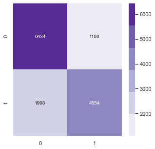

# **TANZANIA WELLS PREDICTION** 

Author : Paul Ngatia 
---

> Summary Project Description [here](https://github.com/learn-co-curriculum/dsc-phase-3-project-v2-3)

## Overview 
Approximately 70% of the earth's surface is made up of water, one of the few necessities shared by all living things. Although there is some scarcity on land, regrettably, 96.5 percent of its coverage is made up of waters. Tanzania is among the nations that struggle with the lack of this essential resource for survival. Due to scarce resources for water extraction, this developing country, home to more than 57,000,000 people, struggles to meet the demand for clean drinking water. While there are currently some water pumps in the nation, some are sadly out of commission and others require maintenance.

In the context of Tanzania, where this remains a persistent problem, predictive modeling emerges as a promising approach to enhance water resource management and optimize the drilling of new wells. By leveraging historical data, advanced statistical techniques, and machine learning algorithms, we aim to develop a robust predictive model that can accurately estimate the potential success and yield of water wells across different regions in Tanzania.

---
---

## 1. Business Understanding
#### Problem statement
Despite efforts to improve water access in Tanzania, our stakeholder, The Ministry Of Water- (MOW) also finds that three out of ten people still lack access to clean water, highlighting the critical need for investment to improve water hygiene and accessibility. Water poverty has been considered to drive serious illnesses, high infant mortality rates, poor education, slumped economies and unproductive agricultural conditions in a majority of the regions. 

The existing approach to drilling water wells in Tanzania relies heavily on experience and local knowledge, which often leads to inconsistent results and ineffective resource utilization. Moreover, the scarcity of reliable data and the complex interplay of geological, hydrological, and climatic factors pose additional barriers to identifying suitable well locations and estimating their potential yield accurately. 

As the project's data scientist, it will be our responsibility to find patterns in the broken wells so that we might have an impact on the construction of new ones. Additionally, by utilizing these trends, we will empower our stakeholders to precisely forecast the water locations that currently want attention, guaranteeing that Tanzanians have access to clean, drinkable water.

#### Objectives

- Create a reliable prediction model for Tanzanian water wells by utilizing statistical methods and machine learning algorithms. Based on the determined influential elements, the model ought to provide an accurate assessment of the possible success rate and yield of water wells.
- To determine the primary factors that have a major impact on Tanzanian water wells' functionality, conduct a detailed analysis of the dataset.

#### Research questions
* Which machine learning algorithms and statistical approaches are most suited for developing a precise predictive model for Tanzanian water wells?  
* How can the prediction model be improved and verified to guarantee its accuracy and applicability?

#### Success criteria
##### Business success criteria
* There should be a discernible rise in Tanzania's success rate for installing water wells as a result of the predictive modeling study. 
* Correctly identifying a well's functionality and assessing its feasibility are important aspects of the project. 

##### Project success criteria

* Generating a model that will be able to correctly predict the quality status of the wells in Tanzania with an accuracy of 75%.
---
---
## 2. Data Understanding

In this project we shall use a dataset containing information about existing water wells in Tanzania  sourced from an ongoing  DrivenData competition.

### 2.1 Data Description

* The dataset contains 59,400 records and spans 40 columns. Of these columns, we identified 31 to be categorical, and 9 as numeric. 
* Four CSV files have been provided. One titled(Training set values) contains training set values with data on the independent features for the training set. The training set labels file (Training set labels) contains data on the dependent variable. The test set values (Test set values) contains values that will be used for prediction. A submission format (Submission format) has also been provided as this was a data science competition and the results of the analysis need to be in a specific format.

---
---

## 3. Data Preparation 

Our stakeholders will benefit from this dataset's analysis and classification, which will help with better upkeep of the current water wells and provide insightful data for upcoming wells.

### 3.1 Data Selection

* I conducted an analysis of the data in order to pinpoint the most important characteristics that have a big impact on how well water wells perform. I was able to accomplish this by using exploratory data analysis, correlation analysis, and domain expertise. I also chose a subset of attributes that show strong correlations with successful outcomes and eliminated variables that were unnecessary or repetitive.
* The dataset has a large number of duplicate columns. For instance information is the same for `payment` and `payment_type`, `source` and `source_type`. I removed the columns inoreder to prepare data for modelling.

### 3.2 Data Cleaning

* Some features are similar to one another, such as **extraction_type**, **extraction_type_group**, and **extraction_type_class**, as well as **waterpoint_type** and **waterpoint_type_group**. In order to reduce the dimensionality of the data, the most generic columns for each overlapped column were kept since the same information being represented at many levels would raise multicollinearity concerns.
* Checking for validity in the data, the dataset was checked for any duplicated values and outliers. The duplicated records were not dropped as it does not mean that they were similar wells but just built under the same project. We also chose not to drop the outliers, as it did not display erroneous data but will be further looked into in the analysis section. 
* After cleaning the dataset, we need to bring uniformity by formatting and the columns to be readable and easily interpretable. So I defined functions to make these possible.
---
---

## 4. Modelling

First, we highlight the large size of our dataset and the imbalance in classes, mainly pertaining from "functional" and "non-functional" wells. Since the majority of our information comes from operational wells, maintaining the current imbalance isn't a priority for us.
My target was the "status_group" variable. I converted it from ternery to a binary format, which generally indicates if a water well is operational or not. The categories "functional needs repair" and "non-functional" can be combined to represent non-operating wells as a single category, while "functional" stays the same. After label-encoding the categorical variables, I categorized the target.  To evaluate the fundamental performance of our selected features, I created a baseline model called Dummy Classifier and used the StandardScaler as my scaler. I subsequently investigated more complex models, such as Random Forest, SVM, K-Nearest-Neighbors, and Decision trees.

---
---

## 5. Evaluation

Before fitting the data to the model, I scaled it using pipelines. Subsequently, to assest the effectiveness of our model, I additionally employed a confusion matrix. My algorithm was able to predict up to 78% of the functionality with a moderate level of success.

I ran a total of 8 models, the baseline models and their hyperparameter tuned versions. The performance of the models varied with some overfitting on the training data and some not performing as well as expected. Notably, the performance of the some models reduced when I hyperparameter tuned the model. I attribute this to not having a wide enough search space for the best parameters. This can be improved upon in other iterations of the model

The best performing model was RandomForestClassifier with an accuracy score of 78%. 

---
---

## 6. Conclusion

Based on the findings of this study, I would advise the Ministry of Water to employ this model exclusively within the parameters set forth by the problem i.e. whether it is "functional" or "non-functional." Ministry of Water should also gather more data on the features used to build the model as well as more relevant details such as Consumption of water to be able to make the model better.

Even though, the analysis may not provide a complete solution to the current issue. I was limited by time, among other things. More time would have allowed for the construction of better models. The machine I was using also put limitations on me. There are certain computationally expensive strategies, such as hyperparameter tuning. Since these strategies have lengthy run periods, it is necessary to limit their application.

More robust techniques can also be used to clean the data, as well as collection of actual data to avoid imputation. More computation power can be added to effectively make use of hyperparameter tuning with GridSearchCV.

---
---

